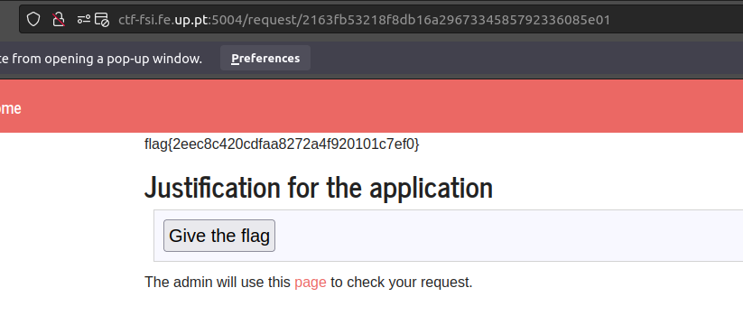

### CTF 6

On the port 5004 of the ctf-fsi.fe.up.pt server there was an text type input with no characters validation and therefore vulnerable to xss.

The main idea was to get an admin to make a post request of the type ../request/{id}/approve from the 5005 port of the same server.

Therefore we created a form similar to the the one in the "Give The Flag" button on the 5005 port  with slight differences and an extra line with a script to automatically run the request on load.

    <form method="post" action="http://ctf-fsi.fe.up.pt:5005/request/{id}}/approve" role="form" target="_blank">
    

        <input type="submit" id="giveflag" value="Give the flag">
    

    </form>
    

Changes:
* Removed the disabled tag from the input.
* Added target="_blank" in order not to change screen when submitting

