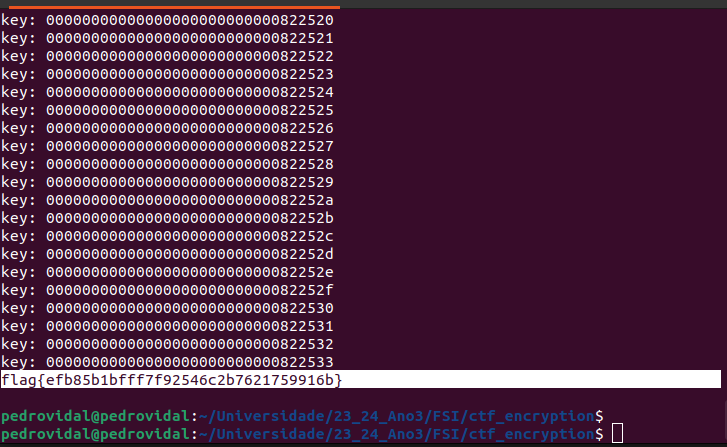

# Crypto Encryption

## Task 1

For this task we are presented with monoalphabetic cipher, whose key is generated by the following python script:

```py
s = "abcdefghijklmnopqrstuvwxyz"
list = random.sample(s, len(s))
key = ’’.join(list)
print(key)
```

Then we convert every uppercase letters to lowercase and remove numbers.
```
$ tr [:upper:] [:lower:] < ciphertext.txt > lowercase.txt
$ tr -cd ’[a-z][\n][:space:]’ < lowercase.txt > plaintext.txt
```

Since monoalphabetic ciphers are crackable using frequency analysis we then were able to reach to this key

|Cipher|Letter|
|------|------|
|  a   |  c   |
|  b   |  f   |
|  c   |  m   |
|  d   |  y   |
|  e   |  p   |
|  f   |  v   |
|  g   |  b   |
|  h   |  r   |
|  i   |  l   |
|  j   |  q   |
|  k   |  x   |
|  l   |  w   |
|  m   |  i   |
|  n   |  e   |
|  o   |  j   |
|  p   |  d   |
|  q   |  s   |
|  r   |  g   |
|  s   |  k   |
|  t   |  h   |
|  u   |  n   |
|  v   |  a   |
|  w   |  z   |
|  x   |  o   |
|  y   |  t   |
|  z   |  u   |


```
tr ’viytngzupcqxehmrblafdjswko’ ’ALTHEBUNDMSOPRIGFWCVYQKZXJ’ < plaintext.txt > out.txt
```

’viytngzupcqxehmrblafdjswko’ 
’ALTHEBUNDMSOPRIGFWCVYQKZXJ’

```
THE OSCARS TURN  ON SUNDAY WHICH SEEMS ABOUT RIGHT AFTER THIS LONG STRANGE
AWARDS TRIP THE BAGGER FEELS LIKE A NONAGENARIAN TOO

THE AWARDS RACE WAS BOOKENDED BY THE DEMISE OF HARVEY WEINSTEIN AT ITS OUTSET
AND THE APPARENT IMPLOSION OF HIS FILM COMPANY AT THE END AND IT WAS SHAPED BY
THE EMERGENCE OF METOO TIMES UP BLACKGOWN POLITICS ARMCANDY ACTIVISM AND
A NATIONAL CONVERSATION AS BRIEF AND MAD AS A FEVER DREAM ABOUT WHETHER THERE
OUGHT TO BE A PRESIDENT WINFREY THE SEASON DIDNT JUST SEEM EXTRA LONG IT WAS
EXTRA LONG BECAUSE THE OSCARS WERE MOVED TO THE FIRST WEEKEND IN MARCH TO
AVOID CONFLICTING WITH THE CLOSING CEREMONY OF THE WINTER OLYMPICS THANKS
PYEONGCHANG

ONE BIG QUESTION SURROUNDING THIS YEARS ACADEMY AWARDS IS HOW OR IF THE
CEREMONY WILL ADDRESS METOO ESPECIALLY AFTER THE GOLDEN GLOBES WHICH BECAME
A JUBILANT COMINGOUT PARTY FOR TIMES UP THE MOVEMENT SPEARHEADED BY 
POWERFUL HOLLYWOOD WOMEN WHO HELPED RAISE MILLIONS OF DOLLARS TO FIGHT SEXUAL
HARASSMENT AROUND THE COUNTRY

SIGNALING THEIR SUPPORT GOLDEN GLOBES ATTENDEES SWATHED THEMSELVES IN BLACK
SPORTED LAPEL PINS AND SOUNDED OFF ABOUT SEXIST POWER IMBALANCES FROM THE RED
CARPET AND THE STAGE ON THE AIR E WAS CALLED OUT ABOUT PAY INEQUITY AFTER
ITS FORMER ANCHOR CATT SADLER QUIT ONCE SHE LEARNED THAT SHE WAS MAKING FAR
LESS THAN A MALE COHOST AND DURING THE CEREMONY NATALIE PORTMAN TOOK A BLUNT
AND SATISFYING DIG AT THE ALLMALE ROSTER OF NOMINATED DIRECTORS HOW COULD
THAT BE TOPPED

AS IT TURNS OUT AT LEAST IN TERMS OF THE OSCARS IT PROBABLY WONT BE

WOMEN INVOLVED IN TIMES UP SAID THAT ALTHOUGH THE GLOBES SIGNIFIED THE
INITIATIVES LAUNCH THEY NEVER INTENDED IT TO BE JUST AN AWARDS SEASON
CAMPAIGN OR ONE THAT BECAME ASSOCIATED ONLY WITH REDCARPET ACTIONS INSTEAD
A SPOKESWOMAN SAID THE GROUP IS WORKING BEHIND CLOSED DOORS AND HAS SINCE
AMASSED  MILLION FOR ITS LEGAL DEFENSE FUND WHICH AFTER THE GLOBES WAS
FLOODED WITH THOUSANDS OF DONATIONS OF  OR LESS FROM PEOPLE IN SOME 
COUNTRIES


NO CALL TO WEAR BLACK GOWNS WENT OUT IN ADVANCE OF THE OSCARS THOUGH THE
MOVEMENT WILL ALMOST CERTAINLY BE REFERENCED BEFORE AND DURING THE CEREMONY 
ESPECIALLY SINCE VOCAL METOO SUPPORTERS LIKE ASHLEY JUDD LAURA DERN AND
NICOLE KIDMAN ARE SCHEDULED PRESENTERS

ANOTHER FEATURE OF THIS SEASON NO ONE REALLY KNOWS WHO IS GOING TO WIN BEST
PICTURE ARGUABLY THIS HAPPENS A LOT OF THE TIME INARGUABLY THE NAILBITER
NARRATIVE ONLY SERVES THE AWARDS HYPE MACHINE BUT OFTEN THE PEOPLE FORECASTING
THE RACE SOCALLED OSCAROLOGISTS CAN MAKE ONLY EDUCATED GUESSES

THE WAY THE ACADEMY TABULATES THE BIG WINNER DOESNT HELP IN EVERY OTHER
CATEGORY THE NOMINEE WITH THE MOST VOTES WINS BUT IN THE BEST PICTURE
CATEGORY VOTERS ARE ASKED TO LIST THEIR TOP MOVIES IN PREFERENTIAL ORDER IF A
MOVIE GETS MORE THAN  PERCENT OF THE FIRSTPLACE VOTES IT WINS WHEN NO
MOVIE MANAGES THAT THE ONE WITH THE FEWEST FIRSTPLACE VOTES IS ELIMINATED AND
ITS VOTES ARE REDISTRIBUTED TO THE MOVIES THAT GARNERED THE ELIMINATED BALLOTS
SECONDPLACE VOTES AND THIS CONTINUES UNTIL A WINNER EMERGES

IT IS ALL TERRIBLY CONFUSING BUT APPARENTLY THE CONSENSUS FAVORITE COMES OUT
AHEAD IN THE END THIS MEANS THAT ENDOFSEASON AWARDS CHATTER INVARIABLY
INVOLVES TORTURED SPECULATION ABOUT WHICH FILM WOULD MOST LIKELY BE VOTERS
SECOND OR THIRD FAVORITE AND THEN EQUALLY TORTURED CONCLUSIONS ABOUT WHICH
FILM MIGHT PREVAIL

IN  IT WAS A TOSSUP BETWEEN BOYHOOD AND THE EVENTUAL WINNER BIRDMAN
IN  WITH LOTS OF EXPERTS BETTING ON THE REVENANT OR THE BIG SHORT THE
PRIZE WENT TO SPOTLIGHT LAST YEAR NEARLY ALL THE FORECASTERS DECLARED LA
LA LAND THE PRESUMPTIVE WINNER AND FOR TWO AND A HALF MINUTES THEY WERE
CORRECT BEFORE AN ENVELOPE SNAFU WAS REVEALED AND THE RIGHTFUL WINNER
MOONLIGHT WAS CROWNED

THIS YEAR AWARDS WATCHERS ARE UNEQUALLY DIVIDED BETWEEN THREE BILLBOARDS
OUTSIDE EBBING MISSOURI THE FAVORITE AND THE SHAPE OF WATER WHICH IS
THE BAGGERS PREDICTION WITH A FEW FORECASTING A HAIL MARY WIN FOR GET OUT

BUT ALL OF THOSE FILMS HAVE HISTORICAL OSCARVOTING PATTERNS AGAINST THEM THE
SHAPE OF WATER HAS  NOMINATIONS MORE THAN ANY OTHER FILM AND WAS ALSO
NAMED THE YEARS BEST BY THE PRODUCERS AND DIRECTORS GUILDS YET IT WAS NOT
NOMINATED FOR A SCREEN ACTORS GUILD AWARD FOR BEST ENSEMBLE AND NO FILM HAS
WON BEST PICTURE WITHOUT PREVIOUSLY LANDING AT LEAST THE ACTORS NOMINATION
SINCE BRAVEHEART IN  THIS YEAR THE BEST ENSEMBLE SAG ENDED UP GOING TO
THREE BILLBOARDS WHICH IS SIGNIFICANT BECAUSE ACTORS MAKE UP THE ACADEMYS
LARGEST BRANCH THAT FILM WHILE DIVISIVE ALSO WON THE BEST DRAMA GOLDEN GLOBE
AND THE BAFTA BUT ITS FILMMAKER MARTIN MCDONAGH WAS NOT NOMINATED FOR BEST
DIRECTOR AND APART FROM ARGO MOVIES THAT LAND BEST PICTURE WITHOUT ALSO
EARNING BEST DIRECTOR NOMINATIONS ARE FEW AND FAR BETWEEN

```


## Task 2

The goal of this task is to try three different cipher types using openssl.
We can list the available ciphertypes by checking the manual  with  $ man enc


aes-128-cbc
```
$ openssl enc -aes-128-cbc -e -in out.txt -out cipher.bin -K 00112233445566778889aabbccddeeff -iv 0102030405060708
$ openssl enc -aes-128-cbc -e -in cipher.bin -out dec.txt -K 00112233445566778889aabbccddeeff -iv 0102030405060708
```

bf-cbc
```
$ openssl enc -bf-cbc -e -in out.txt -out cipher.bin -K 00112233445566778889aabbccddeeff -iv 0102030405060708
$ openssl enc -bf-cbc -d -in cipher.bin -out dec.txt -K 00112233445566778889aabbccddeeff -iv 0102030405060708
```

aes-128-cfb
```
$ openssl enc -aes-128-cfb -e -in out.txt -out cipher.bin -K 00112233445566778889aabbccddeeff -iv 0102030405060708
$ openssl enc -aes-128-cfb -d -in cipher.bin -out dec.txt -K 00112233445566778889aabbccddeeff -iv 0102030405060708
```


## Task 3

For this task we want to encrypt a picture, so people without the key can't see it.
However the first 54 bytes of  .bmp file contains the header.
In order to be able to see the encrypted picture we'll put the header of the original picture on the encrypted one, using this commands:

```
$ head -c 54 p1.bmp > header
$ tail -c +55 p2.bmp > body
$ cat header body > new.bmp
```

ECB encryption
```
$ openssl enc -aes-128-ecb -e -in pic_original.bmp -out p2.bmp -K 00112233445566778889aabbccddeeff -iv 0102030405060708
```


CBC ecryption
```
openssl enc -aes-128-cbc -e -in pic_original.bmp -out p2.bmp -K 00112233445566778889aabbccddeeff -iv 0102030405060708
```


## CTF

For this challenge we were given a python script with three algorithms:

* gen() -> How the encryption key is generated
* enc() -> encrpytion of a message using AES-CTR algorithm given a key and a nounce
* dec() -> decryption of a ciphertext using AES-CTR algorithm given a key and a nounce

In the port 6003 of the ctf-fsi.fe.up.pt server we were given the nounce and the ciphertext to be decripted

* nounce: 04966f8808698c43fbab82fac6196196
* ciphertext: 69f4e9a512825c9ac8316d10cad6ee261a58b71190e4d504765b30bdd052c6ad89585392c2dd4b

Generally AES-CTR is a secure encryption method unless the key can be easily guessed.
Which is the case of this one.
Given the gen() algorithm:
```py
KEYLEN = 16
def gen(): 
	offset = 3 # Hotfix to make Crypto blazing fast!!
	key = bytearray(b'\x00'*(KEYLEN-offset)) 
	key.extend(os.urandom(offset))
	return bytes(key)
```

We noitced the first 13 bytes of the key are always 0x00 whereas the last 3 are random
This drastically reduces the number of possible keys from 2 *(8*16) to 2 * (8*3), which allows a brute force attack.

To automate this we wrote a script that appends every byte array of length 3 to a prefix made of 13 \x00 until we find a message started by "flag{" which is the known flag.

```py
def find_key():
	nounce = unhexlify('ce040ea87024867cd32c43020e9cb3ea')
	ciphertext = unhexlify('56d7b1c581a723e47ac878bdc060442a61d7ed5ad117f3f96ff47c6974275eb64e5d9c53f25a88')
	prefix = b'\x00' * 13
	for i in range(256):
		for j in range(256):
			for k in range(256):
				suffix = bytearray([i,j,k])
				key = prefix + suffix
				msg = dec(key, ciphertext, nounce)
				print(f"key: {key.hex()}")
				try:
					msg = msg.decode('ascii')
					print(msg)
					if(msg[0:5] == 'flag{'):
						return
				except:
					pass
```

After running the script for a while we got the flag:

```
flag{efb85b1bfff7f92546c2b7621759916b}
```




