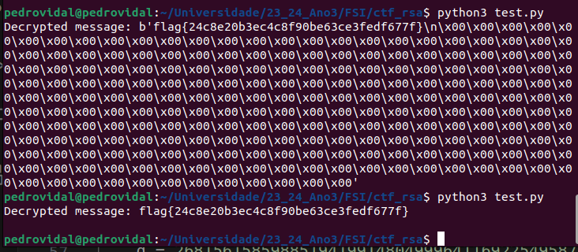

# Setup

For this lab we'll be using docker containers.
This lab is personalized for each student, requiring us to define the server name in the etc/hosts file as:

```
www.<name><year>.com 
```


## Task 1 - Becoming a Certificate Authority (CA)

A Certificate Authority (CA) is a trusted entity that issues digital certificates.
For this task we'll become a root CA ourselves whose Certificate is self signed. We will then use this to issue certificates for others (eg. servers)


### Configuration File
In order to use openssl to issue certificates we need a configuration file.

By default openssl uses the configuration file in 
```
/usr/lib/ssl/openssl.cnf
```

So we'll copy it to our desired folder, edit it and instruct openssl to use ours instead, by setting the environment variable OPENSSL_CONF to the path of the .cnf file or by adding the flag -config <filename> at every command.

After configuring the .cnf file we generate a self-signed certificate, meaning
```
openssl req -x509 -newkey rsa:4096 -sha256 -days 3650 \-keyout ca.key -out ca.crt -config openssl.cnf
```

PEM-Pass: seed


password:seed


What part of the certificate indicates this is a CA’s certificate?
- The beggining of the certificate. Besides stating its a certificate it also has information about the issuer and signature algorithm
  


What part of the certificate indicates this is a self-signed certificate?

- The fact that the issuer is the same as the subject.
  


In the RSA algorithm, we have a public exponente, a private exponentd, a modulusn, and two secretnumberspandq, such thatn=pq.  Please identify the values for these elements in your certificateand key files.


exponent = 65537
private exponent:

p and q:

n (modulus):


## Task 2 - Generating a Certificate Request for Your Web Server
For this task we generate a CA for our server. But before that we need to generate a certifacte signing request (CSR).
The command to do so is the same for the self certificates without the -x509 option.

``` 
openssl req -newkey rsa:2048 -sha256  \-keyout server.key   -out server.csr  \-subj "/CN=www.pedro2023.com/O=Bank32 Inc./C=US" \-passout pass:seed
```

To allow a certificate to have multiple names we can use the SubjectAltName (SAN) extension by adding this option in the commnad line:
```
-addext "subjectAltName = DNS:www.pedro2023.com,  \DNS:www.pedro2023A.com, \DNS:www.pedro2023B.com"
```

## Task 3 - Generating a Certificate for your server
For this task we'll turn the certificate request for my webserver to a CA by using the self signed trusted CA.
However we need to uncomment the line in the openssl.cnf config file to allow the openssl ca command to copy the file extension from the request to the certificate:

```
# Extension copying option: use with caution.copy_extensions = copy
```
We can then use this command to turn the certificate request to a certificate.
```
openssl ca -config openssl.cnf -policy policy_anything \-md sha256 -days 3650 \-in server.csr -out server.crt -batch \-cert ca.crt -keyfile ca.key
```


## Task 4 -  Task 4: Deploying Certificate in an Apache-Based HTTPS Website

The goal of this task is to learn how public-key certificates are used by websites.

First we need to connect to the docker container in which we will be running the Apache server, using the docksh command

Before running the apache server we need to set up the HTTPS site in the file /etc/apache2/sites-available, where we specify the multiple aliases we want our website to have, as well as the server certificate (Line ➀) and key (Line ➁).

```
<VirtualHost *:443> 
    DocumentRoot /var/www/bank32
    ServerName www.pedro2023.com
    ServerAlias www.pedro2023A.com
    ServerAlias www.pedro2023B.com
    DirectoryIndex index.html
    SSLEngine On 
    SSLCertificateFile /certs/server.crt ➀
    SSLCertificateKeyFile /certs/server.key ➁
</VirtualHost>

<VirtualHost *:80> 
    DocumentRoot /var/www/bank32
    ServerName www.pedro2023.com
    DirectoryIndex index_red.html
</VirtualHost>

# Set the following gloal entry to suppress an annoying warning message
ServerName localhost
```

We would also need to run the following commands to enable Apache's SSL module but they're already executed at the time the container is built.

```
# a2enmod ssl // Enable the SSL module
# a2ensite bank32_apache_ssl // Enable the sites described in this file
```

We can then start the apache server

```
# service apache2 start
```
We found the website www.pedro.2023.com


We are not allowed to, however, to change from http to https, since the certificate authority (us) who issued the server certificate is not recognised by firefox. 


To do so, we need to add our CA with the self signed certificate to the list of authorities recognised by Firefox.
We can do this in
```
about:preferences#privacy
```


## Task 5 - Launching a Man-In-The-Middle Attack

In this task our goal is to set up a MITM attack. We've chosen the www.example.com as the target website.

### Step 1 - Setting up the malicious website:

We will be using the same apache server we have used in the last tasks to impersonate **www.example.com**, to do so all we need to do is change the website name in the sites-available configurations as we did in task 4, we will keep the rest of the configurations the same. Although we could change the front end of the page to resemble the target website, we won't for sake of simplicity.

```
<VirtualHost *:443> 
    DocumentRoot /var/www/bank32
    ServerName www.example.com
    ServerAlias www.pedro2023A.com
    ServerAlias www.pedfro2023B.com
    DirectoryIndex index.html
    SSLEngine On 
    SSLCertificateFile /certs/server.crt
    SSLCertificateKeyFile /certs/server.key
</VirtualHost>

<VirtualHost *:80> 
    DocumentRoot /var/www/bank32
    ServerName www.example.com
    DirectoryIndex index_red.html
</VirtualHost>
```
```
service apache2 restart
```


### Step 2 - Becoming the man in the middle

Now we need to get the HTTPS request to land on our website instead of www.example.com. One way to this is a DNS attack, which we can mimify in this lab by mapping the the hostname www.example.com to the ip address of www.example.com in the /etc/hosts file, by adding this line.

```
10.9.0.80  www.example.com
```

After setting this up, when we try to access www.example.com through https, we get a warning saying the connection is not secure, since the certificate we generated only applies to the server name www.pedro2023.com and not www.example.com


## Task 6 - Launching a Man-In-The-Middle Attack with a Compromised CA

For this task we will simulate a Man-In-The-Middle-Attack, such as before. However this time the attacker has access to the CA's private key.
This allows him to generate a new certificate for the fake web server he created, making the web browser of the victim thrust the fake website, and therefore avoid raising suspicion.

Using the password for the CA we createad in Task1 (seed), we generate a certificate request and then convert into an actual certificate with the name of the www.example.com server.

``` 
$ openssl req -newkey rsa:2048 -sha256  \-keyout mitm.key   -out mitm.csr  \-subj "/CN=www.example.com/O=Bank32 Inc./C=US" \-passout pass:seed
$ openssl ca -config openssl.cnf -policy policy_anything \-md sha256 -days 3650 \-in mitm.csr -out mitm.crt -batch \-cert ca.crt -keyfile ca.key
```

We then add the certificate and key to the /certs folder of the apache server and change the sites-available configuration to use the newly defined certificate.

/etc/apache2/sites-available/bank32_apache_ssl.conf
```
<VirtualHost *:443> 
    DocumentRoot /var/www/bank32
    ServerName www.example.com
    ServerAlias www.pedro2023A.com
    ServerAlias www.pedfro2023B.com
    DirectoryIndex index.html
    SSLEngine On 
    SSLCertificateFile /certs/mitm.crt
    SSLCertificateKeyFile /certs/mitm.key
</VirtualHost>

<VirtualHost *:80> 
    DocumentRoot /var/www/bank32
    ServerName www.example.com
    DirectoryIndex index_red.html
</VirtualHost>
```


## CTF - RSA Encryption

For this challenge we were given the python script used to encrypt the flag.
In the port 6004 of the ctf-fsi.fe.up.pt server we were given the public exponent, the modulus and the ciphertext.

RSA is a secure encryption method, as long as the modulus is hard to factorize, however we were told the 2 prime factors of the modulus are close to 2^512 and 2^513.

So in order to find those factors we used the Rabin-Miller algorithm on every number in the proximity of those 2 numbers to find out which ones are primes (p and q).

```py
def is_prime(n, k=30): # miller-rabin
   if n < 2: return False
   for p in [2,3,5,7,11,13,17,19,23,29]:
       if n % p == 0: return n == p
   s, d = 0, n-1
   while d % 2 == 0:
       s, d = s+1, d//2
   for i in range(k):
       x = pow(randint(2, n-1), d, n)
       if x == 1 or x == n-1: continue
       for r in range(1, s):
           x = (x * x) % n
           if x == 1: return False
           if x == n-1: break
       else: return False
   return True


def factorize():
    delta = 10000
    for i in range(pow(2,512) - delta, pow(2,512) + delta):
        if is_prime(i)  and n % i == 0:
            p = i
            break

    for i in range(pow(2,513) - delta, pow(2,513) + delta):
        if is_prime(i) and n % i == 0:
            q = i
            break

```

With p and q we can find the private exponent which is equal to:

```py
    d = pow(e,-1, ((p-1)*(q-1)))
```
Knowing the private exponent we are ready to decode the ciphertext, using the given dec() function.
However, since the ciphertext was printed was ecoded and hexlifyied we need to undo those steps before we decode the message.

```py
    ciphertext= b"3234306365326238356161643233353930306436303861653231343666336163356461316134336237333635646365363535373062633362633837393831393063326635383435303535346261643363636535393761663566373033663561623838383463333665633438336534313562323536393263386265363937353138313833663733386539313330383933323138643462646161303734613766623638323638616636663430653237636332333261376565303964643365643962313138383964373433636462633735323538326162643630303666306266343634373035343031353035313866626165663137653831613465363362376334366630303030303030303030303030303030303030303030303030303030303030303030303030303030303030303030303030303030303030303030303030303030303030303030303030303030303030303030303030303030303030303030303030303030303030303030303030303030303030303030303030303030303030303030303030303030303030303030303030303030303030303030303030303030303030303030303030303030303030303030303030303030303030303030303030303030303030303030303030303030303030303030303030303030303030303030303030303030303030303030303030303030303030303030303030303030"

    aux = unhexlify(ciphertext)

    d = pow(e,-1, ((p-1)*(q-1)))

    decrypted_message = dec(aux, d, n)
    print("Decrypted message:", decrypted_message.decode())
```

We got the flag

```
flag{24c8e20b3ec4c8f90be63ce3fedf677f}
```




