## Setup 
For this lab we'll be using three machines connected to the same LAN using 3 containers, as depicted in this image.

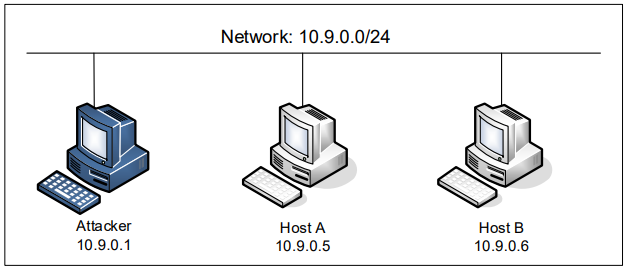

All the containers have the same configuration apart from the attacker container, which was configured as network host, to allow us to see packets among other containers, and therefore sniff packets without problems.

```
network_mode: host
```

The attacker container also has a mounted shared folder, so we can put the attacking code inside the attacker container.
```
volumes:
- ./volumes:/volumes
```

#### Find the network interface name

After running the docker network ls command, we check on the ifconfig which network ID matches with the name br-ID.
In this case br-3a313668f771.

```bash
[12/13/23]seed@VM:~/.../Labsetup$ docker network ls
NETWORK ID          NAME                DRIVER              SCOPE
364b351a5b66        bridge              bridge              local
b3581338a28d        host                host                local
3a313668f771        net-10.9.0.0        bridge              local   <<<<<<<<
77acecccbe26        none                null                local

[12/13/23]seed@VM:~/.../Labsetup$ ifconfig
br-3a313668f771: flags=4163<UP,BROADCAST,RUNNING,MULTICAST>  mtu 1500
        inet 10.9.0.1  netmask 255.255.255.0  broadcast 10.9.0.255
        inet6 fe80::42:eeff:fe19:dac3  prefixlen 64  scopeid 0x20<link>
        ether 02:42:ee:19:da:c3  txqueuelen 0  (Ethernet)
        RX packets 0  bytes 0 (0.0 B)
        RX errors 0  dropped 0  overruns 0  frame 0
        TX packets 40  bytes 6095 (6.0 KB)
        TX errors 0  dropped 0 overruns 0  carrier 0  collisions 0
```

## Task 1 -  Using Scapy to Sniff and Spoof Packets

Although we can use use wireshark for sniffing packets, we'll also be using scapy through this set of tasks, as it is better to use as a building block to construct other tools.

Scapy example code:
```py
#!/usr/bin/env python3
from scapy.all import *
def print_pkt(pkt):
    pkt.show()
pkt = sniff(iface='br-3a313668f771', filter='icmp', prn=print_pkt)
```

### Task 1.1 A

As a root user, after pinging google.com from another container in the LAN, we got the follwing output in the attacker container:
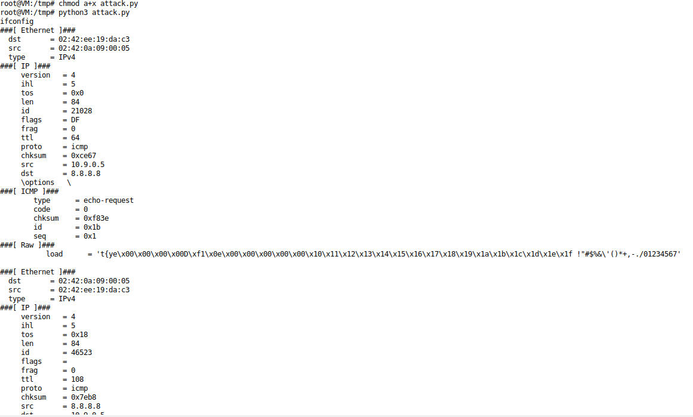

However when not root, we got an error: Permisison Denied
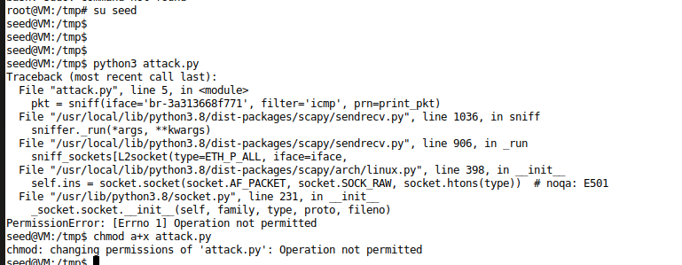  s


This happens because we need full access to the network interfaces which requires us root privilleges

### Task 1.1 B

For this task we're studying the use of filters in Scapy.

• Capture only the ICMP packet


```py
pkt = sniff(iface='br-3a313668f771', filter='icmp', prn=print_pkt)
```


• Capture any TCP packet that comes from a particular IP and with a destination port number 23.

```py
filter='tcp and src host 10.9.0.5 and dst port 23'
```
After using the command from the host with ip 10.9.0.5
```
telnet 10.9.0.6
```

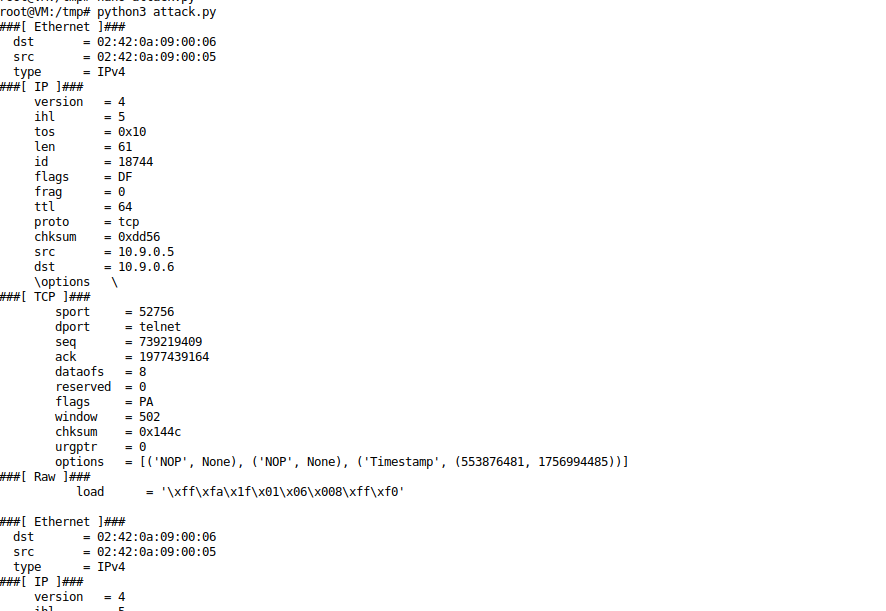


Capture packets comes from or to go to a particular subnet.

```py
filter ='net 128.230.0.0/16'
```
After pinging 128.230.0.1 from host A container, we got the following output on the attacker container.

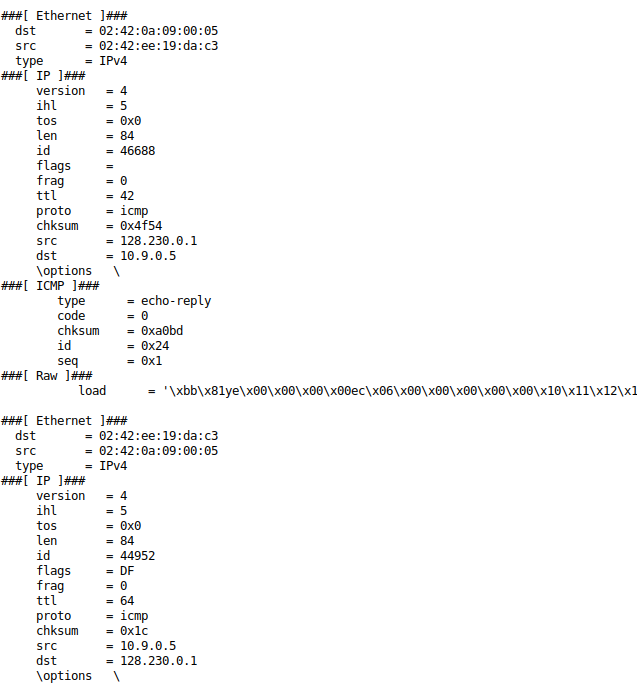


## Task 1.2 - Spoofing ICMP packets

In this task we'll be packet spoofing, which means we will change some attributes of a packet's header (eg.: src ip address).
For this we'll use the code below in scapy and then analyse if we can redirect an ICMP echo request.

```py
from scapy.all import *
a = IP()
a.src ='1.2.3.4'
a.dst='10.9.0.6'
b = ICMP() 
p = a/b 
send(p) 
```

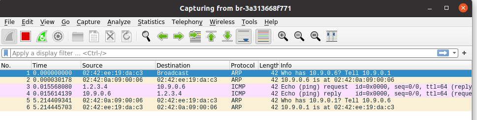

## Task 1.3 - Traceroute

For this task, we're asked to estimate the distance (number of routers), between our container and a selected destination.
For this we develop a python exploit, that attempts to send a ICMP packet with an increasing TTL(time to live) until it eventually reaches its destination.

```py
#!/usr/bin/env python3
from scapy.all import *

inRoute = True
i = 1
while inRoute:
	a = IP(dst='8.8.8.8', ttl=i)
	response = sr1(a/ICMP(),timeout=8,verbose=0)

	if response is None:
		print(f"{i} Request timed out.")
	elif response.type == 0:
		print(f"{i} {response.src}")
		inRoute = False
	else:
		print(f"{i} {response.src}")

	i = i + 1
```

The code we came up with uses the sr1() function that sends and waits for the response of a single ICMP packet.
We then analyse that answer, and terminate the program once, the source of the response is the destination ip address which happens when the type is ICMP echo (0).

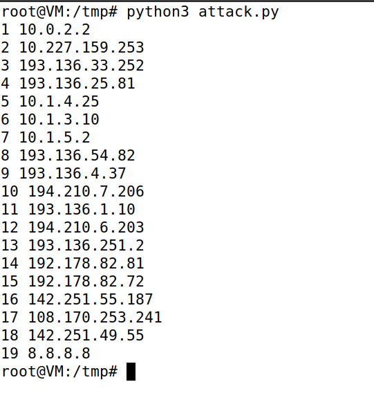

## Task 1.4

In this task we want to intersect every ICMP echo request and answer with a valid echo reply even if the destination of said ping isn't alive.
To do so we need to combine sniffing and spoofing in the same function.
In order for it to be valid, we need to switch the src and dst with each other and change the type to 0 (reply), while keeping every other field the same. «
This is the code we came up with:

```py
#!/usr/bin/env python3
from scapy.all import *

def send_packet(pkt):

	if(pkt[2].type == 8):
		src=pkt[1].src
		dst=pkt[1].dst
		seq = pkt[2].seq
		id = pkt[2].id
		load=pkt[3].load

		print(f"Request: src {src} \t dst {dst}")
		print(f"Reply  : src {dst} \t dst {src}\n")
		reply = IP(src=dst, dst=src)/ICMP(type=0, id=id, seq=seq)/load
		send(reply,verbose=0)

pkt = sniff(iface='br-3a313668f771', filter='icmp', prn=send_packet)
```

When attempted to ping 1.2.3.4 from Host A, the program worked as intended and answered the ping

.png)
<br>

When attempted to ping 10.9.0.99 however, since it is in the same network as host A, it will send "Who has" ARP messages before sending the icmp packets. This makes it so there are no icmp packets for the program to capture and therefore to reply to.

.png)
<br>

When attempted to ping 8.8.8.8 (google.com), the program worked as intended, however since the destination is also alive and replied to each ping, host A received a duplicate of each ping.

.png)


## CTF - Find my TLS

For this CTF we're given a .pcapng file with some TLS connections.
The flag has the following structure:
```
flag{<frame_start>-<frame_end>-<selected_cipher_suite>-<total_encrypted_appdata_exchanged>-<size_of_encrypted_message>}```

Each of the components is related to the tls connection in which the random number of the Client Hello
is 52362c11ff0ea3a000e1b48dc2d99e04c6d06ea1a061d5b8ddbf87b001745a27

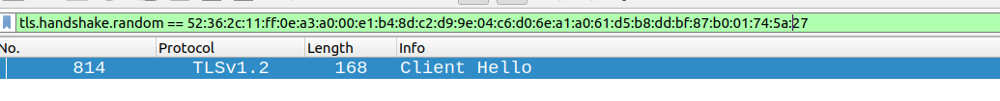

We can start getting the components

frame start - beggining of the TLS handshake - 814
frame end - ending of the TLS handshake Message - 819


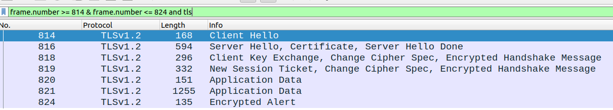

Selected Cipher Suite - defined in Server Hello

```
TLS_RSA_WITH_AES_128_CBC_SHA256
```

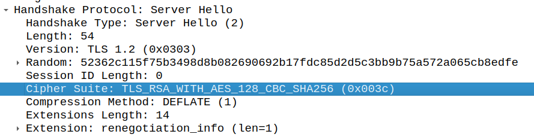


total_encrypted_appdata_exchanged - Sum of the encripted messages of the Application Data
= 80 + 1184 = 1264

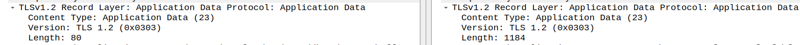


size_of_encrypted_message - size of the encrypted message with which ends the TLS handshake

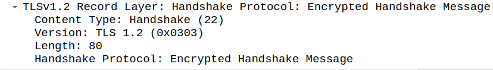

We got the flag

```
flag{814-819-TLS_RSA_WITH_AES_128_CBC_SHA256-1264-80}
```
