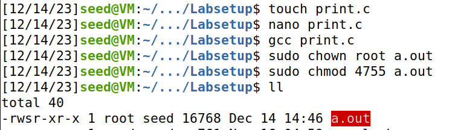

## Task 1 - Manipulating Environment Variables

On this task we've learned we can use printenv or env to display some environment variables followed by the name of a particular variable if we want to know more about it.
We can also use "export" and "unset" to set or unset some variables.


## Task 2 - Passing Environment Variables from Parent Process to Child Process

By running the myprintenv.c twice and putting the respective outputs in different files we came to the conclusion that the child process inherits the parents' environment variables.


## Task 3 - Environment Variables and execve()

We concluded that by running execve() , the new program will only have access to the environment variables passed in the execve() call.


## TASK 4 - Environment Variables and system()

Since the system() function uses execl(), to open a new shell, and execl() calls execve() passing to it every environment variable.
The environment variables are passed to the new program once system() executes


## TASK 5 - Environment Variable and Set-UID Programs

For this task we're studying how are the set-uid programs are affected by environment variables.
To do so we write the following program:

```C
#include <stdio.h>
#include <stdlib.h>
extern char **environ;
int main()
{
    int i = 0;
    while (environ[i] != NULL) {
        printf("%s\n", environ[i]);
        i++;
    }
}
```
Compiled it, Changed its ownership to root and made it a set-UID program

```
sudo chown root foo
sudo chmod 4755 foo
```



We then set the following environment variables' :
* PATH
* LD_LIBRARY_PATH
* VTE_VERSION

After running the setuid program, the shell forks a child process to run the program.
We came to the conclusion that the LD_LIBRARY_PATH environment variable did not get into the Set-UID child process.

```
SHELL=/bin/bash
SESSION_MANAGER=local/VM:@/tmp/.ICE-unix/1856,unix/VM:/tmp/.ICE-unix/1856
QT_ACCESSIBILITY=1
COLORTERM=truecolor
XDG_CONFIG_DIRS=/etc/xdg/xdg-ubuntu:/etc/xdg
XDG_MENU_PREFIX=gnome-
GNOME_DESKTOP_SESSION_ID=this-is-deprecated
GNOME_SHELL_SESSION_MODE=ubuntu
SSH_AUTH_SOCK=/run/user/1000/keyring/ssh
XMODIFIERS=@im=ibus
DESKTOP_SESSION=ubuntu
SSH_AGENT_PID=1806
GTK_MODULES=gail:atk-bridge
PWD=/home/seed/Desktop/Environment_Variable_and_SetUID/Labsetup
LOGNAME=seed
XDG_SESSION_DESKTOP=ubuntu
XDG_SESSION_TYPE=x11
GPG_AGENT_INFO=/run/user/1000/gnupg/S.gpg-agent:0:1
XAUTHORITY=/run/user/1000/gdm/Xauthority
GJS_DEBUG_TOPICS=JS ERROR;JS LOG
WINDOWPATH=2
HOME=/home/seed
USERNAME=seed
IM_CONFIG_PHASE=1
LANG=en_US.UTF-8
LS_COLORS=rs=0:di=01;34:ln=01;36:mh=00:pi=40;33:so=01;35:do=01;35:bd=40;33;01:cd=40;33;01:or=40;31;01:mi=00:su=37;41:sg=30;43:ca=30;41:tw=30;42:ow=34;42:st=37;44:ex=01;32:*.tar=01;31:*.tgz=01;31:*.arc=01;31:*.arj=01;31:*.taz=01;31:*.lha=01;31:*.lz4=01;31:*.lzh=01;31:*.lzma=01;31:*.tlz=01;31:*.txz=01;31:*.tzo=01;31:*.t7z=01;31:*.zip=01;31:*.z=01;31:*.dz=01;31:*.gz=01;31:*.lrz=01;31:*.lz=01;31:*.lzo=01;31:*.xz=01;31:*.zst=01;31:*.tzst=01;31:*.bz2=01;31:*.bz=01;31:*.tbz=01;31:*.tbz2=01;31:*.tz=01;31:*.deb=01;31:*.rpm=01;31:*.jar=01;31:*.war=01;31:*.ear=01;31:*.sar=01;31:*.rar=01;31:*.alz=01;31:*.ace=01;31:*.zoo=01;31:*.cpio=01;31:*.7z=01;31:*.rz=01;31:*.cab=01;31:*.wim=01;31:*.swm=01;31:*.dwm=01;31:*.esd=01;31:*.jpg=01;35:*.jpeg=01;35:*.mjpg=01;35:*.mjpeg=01;35:*.gif=01;35:*.bmp=01;35:*.pbm=01;35:*.pgm=01;35:*.ppm=01;35:*.tga=01;35:*.xbm=01;35:*.xpm=01;35:*.tif=01;35:*.tiff=01;35:*.png=01;35:*.svg=01;35:*.svgz=01;35:*.mng=01;35:*.pcx=01;35:*.mov=01;35:*.mpg=01;35:*.mpeg=01;35:*.m2v=01;35:*.mkv=01;35:*.webm=01;35:*.ogm=01;35:*.mp4=01;35:*.m4v=01;35:*.mp4v=01;35:*.vob=01;35:*.qt=01;35:*.nuv=01;35:*.wmv=01;35:*.asf=01;35:*.rm=01;35:*.rmvb=01;35:*.flc=01;35:*.avi=01;35:*.fli=01;35:*.flv=01;35:*.gl=01;35:*.dl=01;35:*.xcf=01;35:*.xwd=01;35:*.yuv=01;35:*.cgm=01;35:*.emf=01;35:*.ogv=01;35:*.ogx=01;35:*.aac=00;36:*.au=00;36:*.flac=00;36:*.m4a=00;36:*.mid=00;36:*.midi=00;36:*.mka=00;36:*.mp3=00;36:*.mpc=00;36:*.ogg=00;36:*.ra=00;36:*.wav=00;36:*.oga=00;36:*.opus=00;36:*.spx=00;36:*.xspf=00;36:
XDG_CURRENT_DESKTOP=ubuntu:GNOME
VTE_VERSION=6003
GNOME_TERMINAL_SCREEN=/org/gnome/Terminal/screen/c7cd7575_b33b_4a2f_b95b_bdbedb9db14e
INVOCATION_ID=d1c593317afb4b03a504661594b19fb8
MANAGERPID=1542
GJS_DEBUG_OUTPUT=stderr
LESSCLOSE=/usr/bin/lesspipe %s %s
XDG_SESSION_CLASS=user
TERM=xterm-256color
LESSOPEN=| /usr/bin/lesspipe %s
USER=seed
GNOME_TERMINAL_SERVICE=:1.619
DISPLAY=:0
SHLVL=1
QT_IM_MODULE=ibus
XDG_RUNTIME_DIR=/run/user/1000
JOURNAL_STREAM=9:33032
XDG_DATA_DIRS=/usr/share/ubuntu:/usr/local/share/:/usr/share/:/var/lib/snapd/desktop
PATH=/usr/local/sbin:/usr/local/bin:/usr/sbin:/usr/bin:/sbin:/bin:/usr/games:/usr/local/games:/snap/bin:.
GDMSESSION=ubuntu
DBUS_SESSION_BUS_ADDRESS=unix:path=/run/user/1000/bus
OLDPWD=/home/seed/Desktop/Environment_Variable_and_SetUID
_=./a.out

```

## TASK 6 - The PATH Environment Variable and Set-UID Programs

For this task we're given a set-UID program owned by root.

```C
int main()
{
    system("ls");
    return 0;
}

```

Since the system() function's behaviour is affected by environment variables and the program only uses the relative path for 'ls' instead of the absolute path, if we change the PATH environment to /home/seed where we have a file overwriting the ls function, we can make the program use our implementation of ls instead of the one in /bin/ls

```
export PATH=/home/seed:$PATH
```

```C
#include <stdio.h>
#include <unistd.h>
int main() {
    printf("You've been hacked!")
    return 0;
}
```


## CTF

In the folder /etc/cron.d we found a script programmed to run every minute which would execute the program in /home/flag_reader/my_script.sh. This would happen with flag_reader permissions.

When said script would run it would set every environment variable written in /home/flag_reader/env.

Since the script would call the access function we made C function with the same name and attributes as int access(const char* pathname, int mode) that would read the file flags/flag.txt into a newly created file in tmp instead.

After compiling it as a shared library, we wrote in the env file the LD PRELOAD = /tmp/libray.so in order for the script to load our malicious library before running, giving it permissions of a flag_reader user, and therefore allowing to read the flag.txt file.

```C
    #include <stdlib.h>
    int access(const char* pathname, int mode){
        system("/usr/bin/cat /flags/flag.txt > /tmp/res.txt");
        system("chmod 777 /tmp/res.txt");
    return 0;}
```

