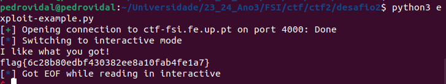

## TASK 1

It's better to launch a shell with assembly rather than using C.

Assembly Code for launching a bash. -> call execve() using as arguemnts the ebx, ecx and edx registers, respectively.

## TASK 2
We're given a file with a buffer overflow vulnerability -> using strcpy() to copy a larger string than a buffer.

Since the function has no boundaries it will cause an overflow.

When compiling the vulnerable program we must turn off the StackGuard and the non-executable Stack protections,
before changing its ownership to root and setting uid in that order.

## TASK 3

After creating the badfile file we now use gdb to debug the stack-L1-dbg in order to get the ebp value when it's pointing to the stack frame of bof()
and the buffer position

### Launching the attack

We need to generate the contents of badfile before running the stack program:
* fill the buffer with NOP
* shellcode at the end of the 517 bytes buffer
* offset = number of bytes between the address of buffer and the return address
* return address value = some address between the return address and the start of the shellcode (eg. &buffer +350)

## TASK 4

For this attack we don't know the buffer and therefore we do not know the return address. but the return address value remains the same since we know the size of the string.

Therefore we only need to put the return address value in every other 4 bytes between the byte 100 and 200 since we know the return address will be in one of them.

Concluding we need to:
* fill the rest of the buffer with NOP's
* put the shellcode at the end of the buffer
* offset = range(100, 200, 4)
* return address value = some address between the return address and the start of the shellcode (eg. &buffer + 350)

## CTF BUFFER OVERFLOW

### Desafio 1

For this challenge we were given a C program in which there were 2 variables
    -> buffer[32]
    -> meme_file[8]

the program would then read 40 bytes from user input before trying to open the file with the name that is written in meme_file.

Since the user can write up to 40 bytes which are then written to a buffer with only 32, a buffer overflow can occur.

Therefore by sending an input with 32 random characters with 'flag.txt' at the end we can override the variable meme_file and get the file flag.txt to be opened and printed into the terminal

### Exploit

    r = remote('ctf-fsi.fe.up.pt', 4003)
    r.recvuntil(b":")
    r.sendline(b"A" * 32 + b'flag.txt')

### Desafio 2

This time the same thing happened. However there was added an additional array which must contain a specific value for the file to be read.
Since we're using little endian, the hexadecimal value had to be passed inverted, or by using the p32() pwn function.

### Exploit

    r = remote('ctf-fsi.fe.up.pt', 4000)
    r.recvuntil(b":")
    r.sendline(b"A" * 32 + p32(0xfefc2324) + b'flag.txt')

    

